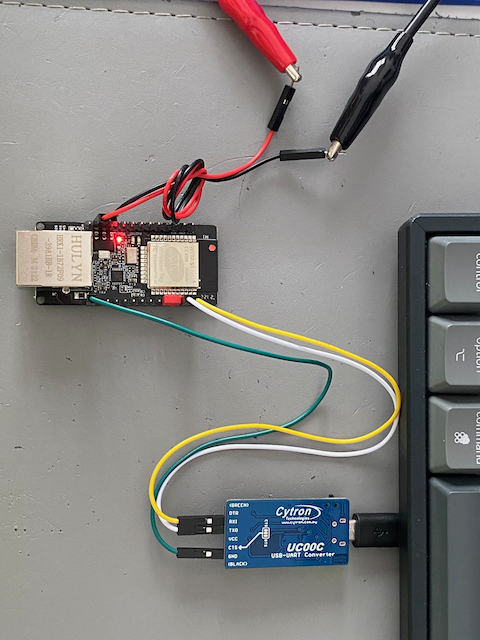
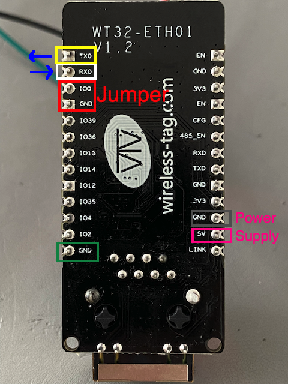
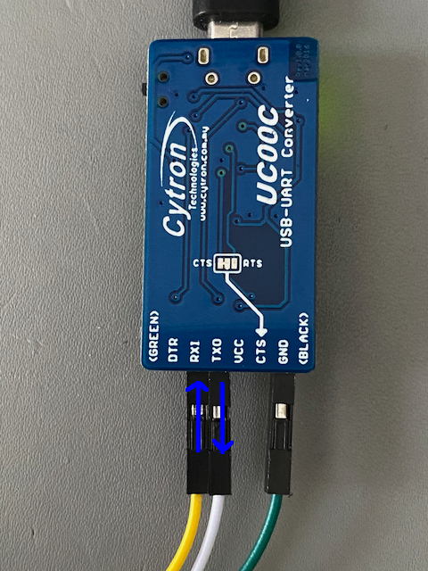
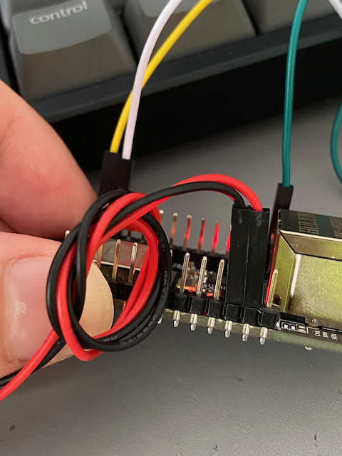
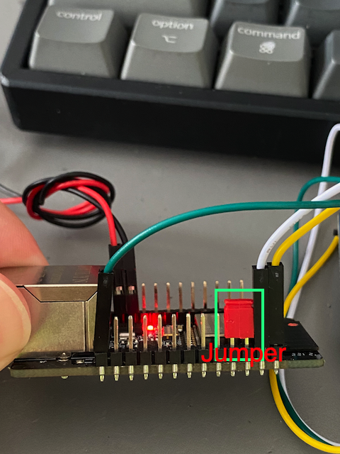
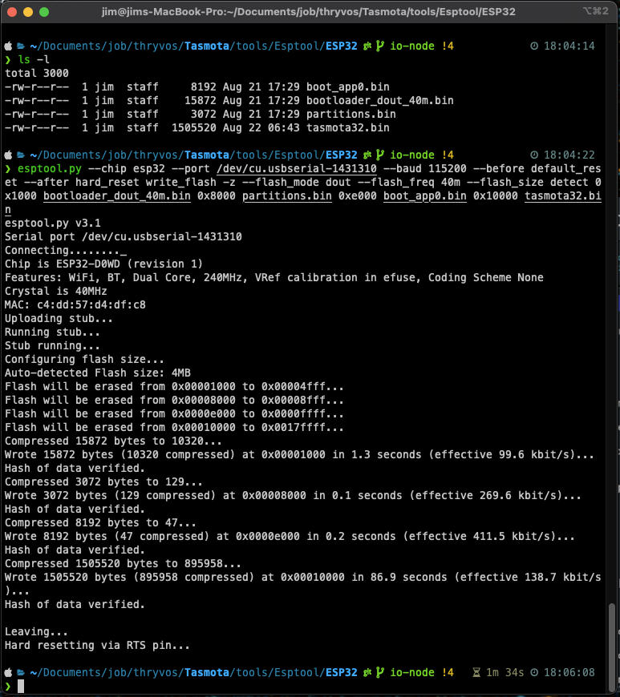
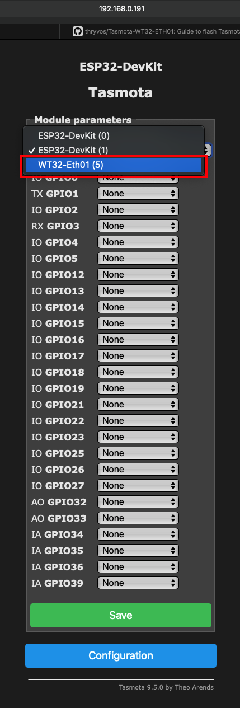
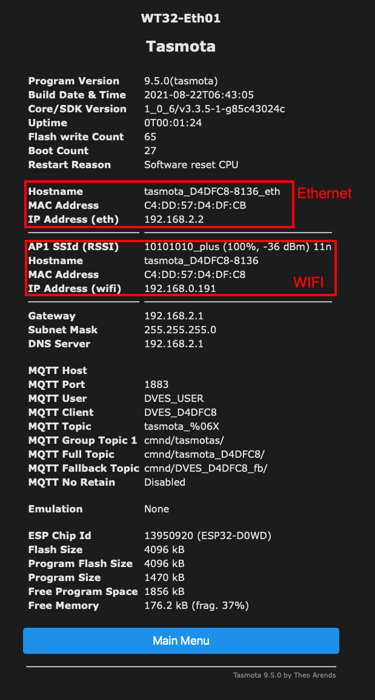
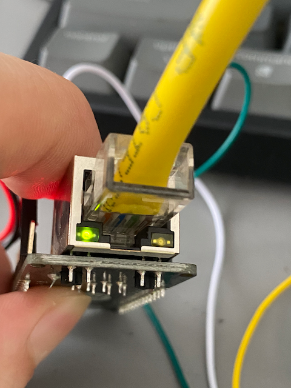

# Tasmota-WT32-ETH01
 Guide to flash Tasmota firmware into WT32-ETH01

## My Setup
* OS: macOS. For Windows please refer [This](https://github.com/arendst/Tasmota/issues/9496#issuecomment-750148023).
* ESP32 Ethernet board: WT32-ETH01 v1.2.
* USB to UART Converter board.
* Tasmota firmware version: 9.5.0.
* [ESP Tools](https://tasmota.github.io/docs/Esptool/).

## Hardware Connection
### Overview connection


### Board labelling connection
* Yellow: TX0, transmit data pin.
* White: RX0, receiving data pin.
* Green: connect to GND pinf of "USB to UART converter" board.
* Red Jumper: IO0 + GND, short these two pins to make WT32-ETH01 enter programming mode.
* Red: connect to external 5V (positive) power supply.
* Back: connect to external GND power supply.



### USB to UART connection


### Close look (Left)
* 5V connection to external power supply.



### Close look (Right)
* Uart and jumper connection



## Steps:
* Follow the hardware connections described above and connect the jumper.
* Power up the board, and the red LED on the board should light up.
* [Download and copy the files from here](https://github.com/thryvos/Tasmota-WT32-ETH01/tree/main/ESP32) to your local folder.
* Goto the folder you copied, and run the following command, you need to change "/dev/cu.usbserial-1431310" to your own port number.
  ```bash
  esptool.py --chip esp32 --port /dev/cu.usbserial-1431310 --baud 115200 --before default_reset --after hard_reset write_flash -z --flash_mode dout --flash_freq 40m --flash_size detect 0x1000 bootloader_dout_40m.bin 0x8000 partitions.bin 0xe000 boot_app0.bin 0x10000 tasmota32.bin
  ```
* After loaded the Tasmota firmware, if successful, you should see the message similar to the following.


* Remove the jumper, then power off and power on to the WT32-ETH01 board. [Follow this guide and access to the Web UI](https://tasmota.github.io/docs/Getting-Started/#initial-configuration)

* In the Web UI, go to [Configuration]->[Configuration Module] and select the module type "WT32-Eth01" as shown below, then click save button and wait for auto restart.



* After restarted, on the main page of the Web UI, click [Information] button, if your Ethernet/LAN cable is connected, you should see the following. If the Ethernet/LAN cable is connected but not the Ethernet information is not displayed, please refesh your Web UI.




* The Ethernet indicator should light up.




# Reference
https://tasmota.github.io/docs/

https://github.com/arendst/Tasmota/issues/9496

https://github.com/arendst/Tasmota/issues/8503
